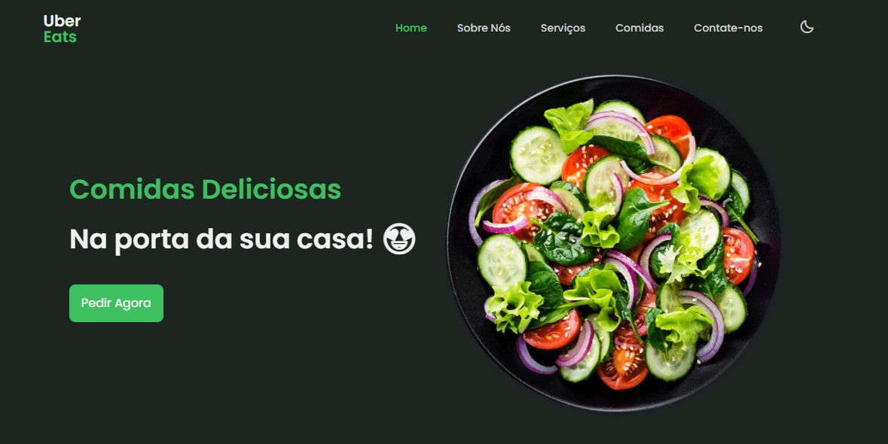

<!---->

# UberEats - Responsive App Landing Page

Esse projeto foi feito por: <strong>Thiago Silva Lopes</strong>, em 01/2022, 
tendo como base o <a href="https://www.youtube.com/watch?v=5RIFrZEjURA" target="_blank">tutorial</a>
do canal do Youtube: <a href="https://www.youtube.com/channel/UCgkDs77BoEhMIgRUB4MKrtQ" target="_blank">
Bedimcode</a>.

## Demo: https://eats-uber.vercel.app
